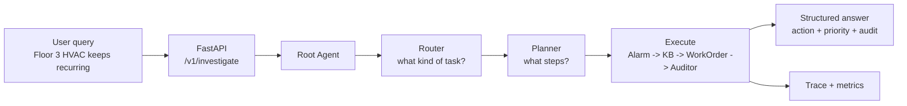
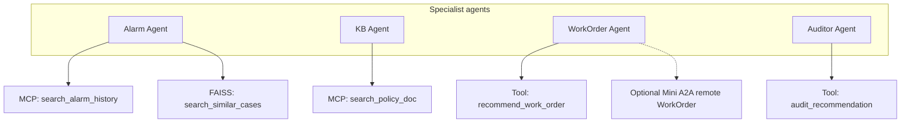
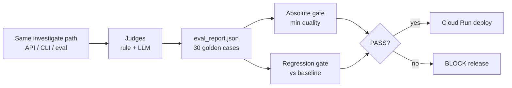

# Facility Management AgentOps - Phase 2

**Enterprise AgentOps on GCP:** a production-oriented facility-management agent platform with dynamic orchestration, MCP tools, reusable ADK skills, vector memory, distributed-agent integration, observability, evaluation, regression gating, and Cloud Run delivery.

> A recurring Floor 3 HVAC alarm becomes an evidence-backed, policy-checked work-order recommendation with an audit verdict, end-to-end traces, and a fail-closed release decision.

Built with **Google ADK**, **Vertex AI (Gemini)**, **FastAPI**, and **Google Cloud**. Phase 1 proved the thin slice. Phase 2 turns it into a measurable and deployable reliability platform.

## What Phase 2 delivers

### Core platform - complete

1. **Expanded evaluation** - 30 golden cases across normal, safety, RAG, tool-failure, and fallback scenarios
2. **Quality and recovery metrics** - task success, tool-call and argument accuracy, groundedness, latency, and failure recovery
3. **Regression-aware release gates** - absolute SLOs plus comparison with versioned milestone baselines
4. **Cloud Build CI/CD** - test, evaluate/gate, build, push, and optionally deploy to Cloud Run
5. **MCP tool isolation** - alarm, policy, and ticket servers with contract and timeout tests
6. **Production observability hooks** - local JSONL traces, structured logs, Cloud Trace, BigQuery export, and a reliability dashboard
7. **Dynamic orchestration** - Router + Planner + bounded recovery/replan around the specialist workflow
8. **Reusable ADK Agent Skills** - three `SKILL.md` packages with on-demand tool activation and skill-level evaluation

### Shipped stretch capabilities

- **Vector memory:** FAISS semantic case retrieval, an offline hash embedder by default, optional Vertex embeddings, keyword fallback, and Recall@K evaluation
- **Mini A2A:** an optional remote WorkOrder agent with an Agent Card, trace propagation, timeout handling, retry, and local fallback

### Not implemented

- Multi-Judge Evaluation (correctness + groundedness + arbiter)
- Terraform infrastructure provisioning
- API authentication and authenticated Cloud Run ingress

These remain roadmap items; the README does not claim them as shipped.

## System architecture

**Interview one-liner:** a building-ops question enters FastAPI, Root routes and plans, specialists gather evidence and recommend a work order, Auditor checks it, then every run is traced and scored so a bad agent version can be blocked before deploy.

### 1) Request path (main story)

Use this diagram first. Walk left to right.



What each stage does:

| Stage | Job |
|---|---|
| Router | Classify the request (alarm / policy / work-order style work) |
| Planner | Build a short plan: investigate -> policy -> recommend |
| Alarm | Look up alarm history + similar past cases |
| KB | Retrieve the matching policy / SOP |
| WorkOrder | Recommend create / escalate / monitor / no-action |
| Auditor | Check the recommendation is grounded and safe |
| Recovery | On tool error/timeout: one bounded retry / replan |

### 2) Tools behind the specialists

Keep this as the "how do tools work?" follow-up.



Key talking points:

- Business tools can run in-process or through **MCP servers** (`USE_MCP_TOOLS=1`).
- Similar cases use **FAISS vector memory** (keyword fallback).
- WorkOrder can stay local or call a **Mini A2A** remote agent with timeout + local fallback.
- Skills (`SKILL.md` + `load_skill`) can activate tools on demand when `USE_ADK_SKILLS=1`.

### 3) Quality loop (why this is AgentOps, not just a demo)



Say this clearly in interview:

1. I score the same path that production uses.
2. Absolute gate checks minimum quality.
3. Regression gate blocks silent degradation against a frozen baseline.
4. Cloud Build only continues when the gate passes.

## Evaluation and release discipline

The repository evaluates the same investigate path used by the CLI and API.

| Layer | What is measured |
|---|---|
| Deterministic judge | Tool selection, arguments, agent coverage, required answer evidence, prohibited behavior, failure recovery |
| LLM judge | Task success, groundedness, tool use, risk, and clarity |
| Retrieval evaluation | Recall@K and relevance for semantic case memory |
| Absolute gate | Minimum quality thresholds and maximum critical failures |
| Regression gate | Quality and latency changes against the active versioned baseline |

The canonical absolute rules are in [`eval_harness/gates/absolute_rules.yaml`](eval_harness/gates/absolute_rules.yaml); regression rules and the active baseline are resolved from [`eval_harness/gates/regression_rules.yaml`](eval_harness/gates/regression_rules.yaml) and [`eval_harness/baselines/`](eval_harness/baselines/).

```bash
# Fast single-case check without the LLM judge
./scripts/run_eval.sh --case-id alarm_001 --skip-llm-judge

# Default alarm dataset: 10 cases
./scripts/run_eval.sh

# Complete Phase 2 suite: 30 cases
./scripts/run_eval.sh --dataset all

# Retrieval-specific evaluation
uv run run-retrieval-eval

# Demonstrate prompt regression -> BLOCK -> restore -> PASS
./scripts/week3_4_regression.sh
```

The gate exits with `0` on PASS and `1` on BLOCK, so it can stop a release automatically.

## Quick start

### Requirements

- Python 3.11+
- [`uv`](https://docs.astral.sh/uv/)
- Google Cloud CLI
- A GCP project with billing and Vertex AI enabled

### Configure GCP

```bash
cp .env.example .env
# Set GOOGLE_CLOUD_PROJECT in .env.

gcloud auth application-default login
gcloud services enable aiplatform.googleapis.com \
  --project="$GOOGLE_CLOUD_PROJECT"
```

The default runtime configuration is:

```dotenv
GOOGLE_CLOUD_LOCATION=us-central1
GOOGLE_GENAI_USE_VERTEXAI=true
# GEMINI_MODEL=gemini-2.5-flash
```

### Install and test

```bash
uv sync --extra dev
uv run pytest -q
```

### Run the main scenario

```bash
uv run python scripts/run_investigate_cli.py \
  "The HVAC alarm on Floor 3 keeps recurring. Check the issue, search policy, decide if we should create a work order, and recommend priority."
```

### Start the API

```bash
uv run fm-agentops-api
```

```bash
curl -s http://localhost:8080/health | jq .

curl -s -X POST http://localhost:8080/v1/investigate \
  -H "Content-Type: application/json" \
  -d '{"query":"The HVAC alarm on Floor 3 keeps recurring. Check the issue, search policy, decide if we should create a work order, and recommend priority."}' \
  | jq .
```

The reliability dashboard is available at `http://localhost:8080/dashboard`; its JSON metrics endpoint is `/dashboard/metrics`.

## Runtime feature flags

| Variable | Default | Purpose |
|---|---:|---|
| `USE_MCP_TOOLS` | `0` locally, `1` in deploy scripts | Use stdio MCP servers instead of in-process business tools |
| `MCP_TOOL_TIMEOUT_SECONDS` | `30` in deployment | Per-tool MCP timeout |
| `USE_ADK_SKILLS` | `0` | Activate tools through ADK `SkillToolset` and `load_skill` |
| `USE_VECTOR_MEMORY` | `1` | Use FAISS semantic case retrieval with keyword fallback |
| `USE_VERTEX_EMBEDDINGS` | `0` | Replace the local hash embedder with Vertex embeddings |
| `USE_A2A_WORKORDER` | `0` | Call the remote WorkOrder A2A service with local fallback |
| `ENABLE_CLOUD_TRACE` | `0` | Export spans to Cloud Trace |
| `ENABLE_BIGQUERY` | `0` | Export observability records to BigQuery |
| `BIGQUERY_DATASET` | `fm_agentops_observability` | BigQuery destination dataset |

Cloud Trace and BigQuery are opt-in to avoid unexpected writes and cost. The A2A service is runnable independently but is not deployed as a second Cloud Run service by the default deployment path.

## CI/CD

Run the release contract locally:

```bash
# pytest -> 30-case agent eval -> absolute gate -> regression gate
./scripts/ci_release.sh

# Reuse an existing eval_report.json (no live Vertex calls)
SKIP_AGENT_EVAL=1 ./scripts/ci_release.sh
```

Submit the Cloud Build pipeline:

```bash
./scripts/submit_ci_build.sh
```

[`deployment/cloudbuild-ci.yaml`](deployment/cloudbuild-ci.yaml) defaults to `_SKIP_AGENT_EVAL=true`: it runs tests and gates against the locally generated `eval_report.json` included in the build context. This design avoids Vertex rate-limit instability in Cloud Build. Set `_SKIP_AGENT_EVAL=false` only when a live cloud evaluation is intended.

Nightly full evaluation is defined separately in [`deployment/cloudbuild-nightly.yaml`](deployment/cloudbuild-nightly.yaml).

## Docker and Cloud Run

### Local Docker

```bash
./scripts/docker_run_local.sh
```

### Cloud Run

The runtime service account needs `roles/aiplatform.user`. Additional Cloud Trace and BigQuery roles are required only when their exporters are enabled.

```bash
./scripts/deploy.sh
```

The deployment script creates the Artifact Registry repository if necessary, builds and pushes the image, and deploys `fm-agentops` in `GOOGLE_CLOUD_LOCATION`.

Important: the current scripts use `--allow-unauthenticated`, and the FastAPI application has no authentication middleware. Treat this as a demonstration deployment; add authenticated ingress and authorization before exposing real facility data or actions.

## Repository layout

| Path | Role |
|---|---|
| `api/` | FastAPI gateway, trace middleware, investigate endpoint, dashboard routes |
| `agents/` | Router, Planner, specialist agents, recovery loop, and WorkOrder A2A integration |
| `mcp_servers/` | Alarm, policy, and ticket MCP servers |
| `skills/` | ADK Agent Skills and skill loader |
| `tools/` | In-process/MCP tool registry and retryable-error contracts |
| `services/` | Shared investigate pipeline used by API, CLI, and evaluation |
| `memory/` | Session store, case memory, embeddings, and FAISS vector index |
| `observability/` | JSONL tracing, structured logging, Cloud Trace, BigQuery, and dashboard |
| `eval_harness/` | Golden datasets, judges, metrics, baselines, reports, and release gates |
| `deployment/` | Docker, Cloud Build, nightly evaluation, and A2A Agent Card |
| `data/mock/` | Synthetic DemoCorp facility data |
| `scripts/` | Local run, evaluation, CI, deployment, smoke, and regression scripts |
| `tests/` | Unit, integration, MCP contract, and A2A contract tests |

## Current boundaries

- Building and work-order records are synthetic.
- The release pipeline relies on evaluation quality; it does not replace runtime authorization or human approval.
- Cloud exporters are optional adapters, not a full OpenTelemetry SDK pipeline.
- FAISS is the implemented vector store; Vertex Vector Search is not implemented.
- Mini A2A covers one remote WorkOrder agent rather than decomposing every specialist into a service.
- Multi-Judge Evaluation and Terraform remain future work.

## Security

- No API keys or service-account JSON files belong in the repository.
- Use Application Default Credentials and keep `.env` local and gitignored.
- Review staged changes for credentials before publishing and use your hosting provider's secret scanning.
- Grant service accounts only the roles required by enabled features.

## Documentation and roadmap

- [`plan_phase1.md`](plan_phase1.md) - completed thin-slice build record
- [`plan_phase2.md`](plan_phase2.md) - platform reliability plan and implementation status
- [`plan_phase3.md`](plan_phase3.md) - retrieval intelligence, execution memory, and Plan -> Check -> Act roadmap
- [`doc/plan.md`](doc/plan.md) - long-term platform vision
- [`docs/phase1_notes.md`](docs/phase1_notes.md) - historical implementation notes
- [`eval_harness/golden_dataset/README.md`](eval_harness/golden_dataset/README.md) - golden-case schema and dataset guide

## Phase progression

| Phase | Question | Status |
|---|---|---|
| Phase 1 | Can the thin slice work end to end and block a bad release? | Complete |
| Phase 2 | Can it operate as a measurable, distributed, reliability-focused agent platform? | Core complete; vector memory and Mini A2A shipped |
| Phase 3 | Can it reason about evidence sufficiency and execution state without adding agent sprawl? | Planned |
