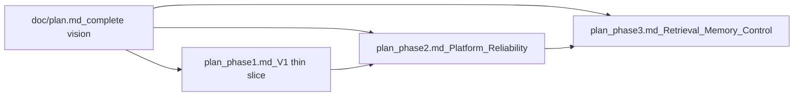
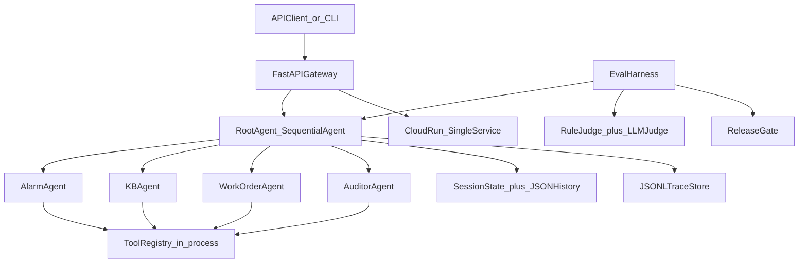

# Facility Management AgentOps - Phase 1 (V1 Thin Slice)

> **North star:** [doc/plan.md](doc/plan.md) - GCP Enterprise Multi-Agent Release Platform  
> **Phase 2:** [plan_phase2.md](plan_phase2.md) - Agent Platformization + Reliability  
> **Phase 3:** [plan_phase3.md](plan_phase3.md) - Retrieval intelligence, execution memory, and Plan -> Check -> Act (newer does not mean more agents)

**In one sentence:** A Build -> Evaluate -> Deploy -> Release loop in which every component is **basic but real**.



---

## 1. User Story and Done definition

### Business scenario

User input:

> "The HVAC alarm on Floor 3 keeps recurring. Check the issue, search policy, decide if we should create a work order, and recommend priority."

The system automatically completes:

```text
Understand user intent
-> Alarm Agent check alarm history + similar cases
-> KB Agent search maintenance policy
-> Work Order Agent determines whether to create/upgrade a work order
-> Auditor Agent checks groundedness
-> Output structured recommendations
-> Log trace / session / tool calls
-> Automatically run eval
-> Release gate determines whether the version can be released
```

### V1 Done Checklist (7 items)

| # | Entry | Status |
|---|------|------|
| 1 | `POST /v1/investigate` returns a structured recommendation | ✅ Completed |
| 2 | Call chain: Alarm -> KB -> WorkOrder -> Auditor (via RootAgent) | ✅ Complete (see V1 simplified description below) |
| 3 | Tool Registry provides mock alarm/policy/ticket data | ✅ Completed |
| 4 | Session state retains intermediate results (basic memory) | ✅ Completed |
| 5 | JSONL trace can restore the complete request | ✅ Completed |
| 6 | Eval harness runs 5+ golden cases + LLM judge + release gate | ✅ 5/5 PASS + gate PASS |
| 7 | Cloud Run single service deployment, the behavior is consistent with local | ✅ Completed |

---

## 2. V1 architecture diagram

### Actual implementation (V1)

V1 uses ADK `SequentialAgent` to fix the pipeline, **deliberately omitting** Router/Planner (completed in Phase 2).



### Phase 2 architecture (implemented after V1)

The current implementation uses RootAgent -> RouterAgent -> PlannerAgent -> a specialist execution loop with recovery. See [plan_phase2.md](plan_phase2.md) and [doc/plan.md](doc/plan.md).

### V1 Out of Scope (historical V1 boundary)

| Capabilities | Processing methods |
|------|----------|
| Standalone MCP server process | Phase 2 |
| A2A remote agents | Phase 2 |
| Vertex Vector Search | Phase 2 (V1 is searched using JSON keyword) |
| Router/Planner dynamic orchestration | Phase 2 (V1 uses SequentialAgent) |
| Multi-agent debate eval | Phase 2 |
| Cloud Build CI / Terraform | Phase 2 |
| Post-training SFT/DPO | Phase 2 |

---

## 3. Component specifications: V1 Basic vs Phase 2 Enhanced

| Components | V1 snapshot | Planned Phase 2 enhancement |
|------|-------------|----------------------|
| FastAPI Gateway | 1 endpoint + trace_id middleware | auth, streaming, rate limit |
| Root orchestration | `SequentialAgent` fixed 4 steps | Router + Planner + dynamic replan |
| Alarm/KB/WorkOrder/Auditor | 4 agents, 1-2 tools each | skills registry, remote A2A |
| Tools | In-process Tool Registry | 3 independent MCP servers |
| Memory | ADK session + `data/memory/cases.json` | FAISS / Vertex Vector Search |
| Tracing | Native JSONL spans | Cloud Trace + BigQuery |
| Eval | 5 cases, rule + LLM judge | Expanded regression dataset and stronger judging |
| Release Gate | YAML + exit code script | Cloud Build gate |
| Deploy | 1 Cloud Run service | multi-service + A2A |

---

## 4. Phase 1 repository structure (historical)

```
fm-agentic-e2e-gcp/
  plan_phase1.md # This file - V1 execution manual
  doc/
    plan.md # Complete vision
  README.md
  pyproject.toml
  .env.example

  api/
    main.py                   # FastAPI app
    routes/investigate.py     # POST /v1/investigate
    schemas.py                # Request/Response pydantic models
    middleware.py               # X-Trace-Id injection

  agents/
    root_agent/agent.py       # SequentialAgent orchestrator
    alarm_agent/              # agent.py, prompts.py, tools.py
    kb_agent/
    workorder_agent/
    auditor_agent/

  tools/
    registry.py               # MCP-style in-process registry

  services/
    investigate.py # Shared pipeline (API/CLI/eval)

  data/
    mock/                     # alarms, policies, tickets, assets, issues, ...
    memory/
      cases.json              # resolved case history
      sessions/ # per-request snapshots (gitignored runtime product)

  memory/
    session_store.py          # ADK session state helpers
    case_store.py             # JSON file read/write
    tools.py                  # search_similar_cases

  observability/
    tracing/
      trace_context.py
      span_recorder.py
      models.py

  eval_harness/
    golden_dataset/alarm_cases.json   # alarm_001 - alarm_005
    runners/run_agent_eval.py
    judges/llm_judge.py
    judges/rule_based_judge.py
    metrics/scorer.py
    gates/absolute_rules.yaml
    release_gate/gate.py
    reports/                  # eval_report.json, traces/*.jsonl

  deployment/
    Dockerfile
    cloudbuild.yaml
  scripts/
    run_agent_cli.py # Local debugging
    run_investigate_cli.py
    run_eval.sh # eval + gate one click
    week3_4_regression.sh # Change prompt regression demonstration
    docker_run_local.sh
    deploy.sh # Cloud Run deployment

  tests/ # pytest unit + integration tests
```

### Differences between doc/plan.md and doc/plan.md

| plan.md target path | V1 actual | remarks |
|------------------|---------|------|
| `router_agent/`, `planner_agent/` | None | Replaced by `SequentialAgent` |
| `tools/alarm_tools.py` etc. | `agents/*/tools.py` | The tool is packaged by agent and exposed uniformly through the registry |
| `agents/shared/model_config.py` | Each agent’s inline Vertex configuration | Phase 2 extracted shared configuration |
| `golden_dataset/safety_cases.json` | Not built | alarm_cases has covered the core scenario |
| `observability/logging/structured_logger.py` | Not yet built | trace JSONL has satisfied V1 |
| `deployment/cloud_run/service.yaml` | `cloudbuild.yaml` + `deploy.sh` | Equivalent |

---

## 5. Agent responsibilities and Tool list

### Agents (V1: 4 sub-agents + 1 Root)

| Agent | Responsibilities | Tools (via Registry) |
|-------|------|----------------------|
| **AlarmAgent** | Check recurring alarm history and search similar cases | `search_alarm_history`, `search_similar_cases` |
| **KBAgent** | Search maintenance policy | `search_policy_doc` |
| **WorkOrderAgent** | Determine whether to create WO + priority | `recommend_work_order` |
| **AuditorAgent** | Check answer grounded, block unsafe action | `audit_recommendation` |
| **RootAgent** | `SequentialAgent` arranges the above 4 agents | No independent tool |

> **Phase 2 outcome:** RouterAgent now classifies intent, and PlannerAgent emits the three-step plan used by the recovery-aware execution loop.

### Tool Registry API

```python
# tools/registry.py
from tools.registry import get_tool, get_tools_for_agent, list_tools

get_tool("search_alarm_history")
get_tools_for_agent("alarm_agent")  # ADK FunctionTool binding
list_tools()
# -> ['search_alarm_history', 'search_similar_cases', 'search_policy_doc',
#    'recommend_work_order', 'audit_recommendation']
```

### Mock data

| Documentation | Purpose |
|------|------|
| `data/mock/alarms.json` | Historical alarms |
| `data/mock/alarm_events.json` | Alarm event stream |
| `data/mock/policies.json` | Maintenance policy |
| `data/mock/tickets.json` | Tickets |
| `data/mock/assets.json` | Device assets |
| `data/mock/issues.json` | Issue ticket |
| `data/memory/cases.json` | Solved case (long-term memory) |

---

## 6. Session State / Memory Schema

After each investigation, `session_store.py` writes the ADK session state snapshot to `data/memory/sessions/{session_id}.json`:

```json
{
  "trace_id": "tr_abc123",
  "session_id": "uuid",
  "alarm_summary": "AHU-3F-01 recurring 7x in 30d, priority high",
  "policy_context": "HVAC-MNT-003: escalate recurring HVAC alarms within 24h",
  "work_order_recommendation": {
    "action": "escalate_existing",
    "work_order_id": "WO-2026-0142",
    "priority": "high"
  },
  "auditor_verdict": {
    "grounded": true,
    "pass": true,
    "violations": []
  },
  "similar_cases": [
    {"case_id": "case-042", "asset_id": "AHU-3F-01", "resolution": "filter replacement"}
  ]
}
```

**Long-term memory:** `case_store.py` retrieves similar cases (without embedding) by `asset_id` / keyword from `data/memory/cases.json`.

---

## 7. Trace Span Schema

Write each span to `eval_harness/reports/traces/{trace_id}.jsonl` (one JSON per line):

```json
{
  "trace_id": "tr_abc123",
  "agent": "alarm_agent",
  "step": "search_alarm_history",
  "input_summary": "Floor 3 HVAC recurring",
  "output_summary": "AHU-3F-01, 7 events in 30d",
  "latency_ms": 420,
  "tokens_input": null,
  "tokens_output": null,
  "tool_calls": ["search_alarm_history"],
  "status": "success",
  "span_type": "tool_call"
}
```

`span_type` values: `request` | `agent_turn` | `tool_call` | `tool_result`.

---

## 8. API specifications

### `POST /v1/investigate`

**Request:**

```json
{
  "query": "The HVAC alarm on Floor 3 keeps recurring...",
  "user_id": "optional-user-id"
}
```

**Response (excerpt):**

```json
{
  "trace_id": "tr_abc123",
  "session_id": "uuid",
  "latency_seconds": 27.4,
  "query": "...",
  "work_order_recommendation": {
    "action": "escalate_existing",
    "priority": "high",
    "fm_priority": "P2"
  },
  "auditor_verdict": {
    "grounded": true,
    "pass": true
  },
  "tools_called": ["search_alarm_history", "search_policy_doc", "recommend_work_order", "audit_recommendation"],
  "agents": ["alarm_agent", "kb_agent", "workorder_agent", "auditor_agent"]
}
```

### `GET /health`

```json
{"status": "ok", "service": "fm-agentops"}
```

### Middleware

- The request can carry `X-Trace-Id`; if it is not provided, the server will automatically generate and write back the response header.

---

## 9. Eval Harness Specifications

### Golden case structure

```json
{
  "case_id": "alarm_001",
  "input": "The HVAC alarm on Floor 3 keeps recurring...",
  "expected_tools": ["search_alarm_history", "search_policy_doc", "recommend_work_order", "audit_recommendation"],
  "expected_agents": ["alarm_agent", "kb_agent", "workorder_agent", "auditor_agent"],
  "expected_answer_contains": ["AHU-3F-01", "recurring", "HVAC-MNT-003", "WO-2026-0142", "escalate"],
  "must_not_contains": ["create a new work order"],
  "must_not_do": ["create a new work order without checking existing"],
  "expected_behavior": ["...", "..."]
}
```

At Phase 1 completion, the dataset was `eval_harness/golden_dataset/alarm_cases.json` with 5 cases (`alarm_001`-`alarm_005`). The current `dataset=all` regression suite contains exactly 30 cases: 10 alarm, 5 safety, 5 RAG, and 10 failure/fallback cases.

### Metrics (V1 priority)

| Priority | Metric | Source |
|--------|--------|------|
| P0 | `tool_call_accuracy` | rule judge |
| P0 | `must_not_violations` | rule judge |
| P0 | `task_success` | LLM judge |
| P1 | `groundedness` | LLM judge |
| P1 | `answer_keyword_score` | rule judge |
| P1 | `latency_seconds` | trace |
| P2 | `cost_usd` | Not implemented |

### Release Gate

The historical Phase 1 thresholds now live in the canonical
`eval_harness/gates/absolute_rules.yaml`:

```yaml
pass_rate: ">= 0.9"
avg_tool_call_accuracy: ">= 0.90"
avg_answer_keyword_score: ">= 0.90"
avg_task_success: ">= 0.85"
avg_groundedness: ">= 0.90"
critical_failures: "<= 1"
```

> `avg_task_success` and `avg_groundedness` are automatically skipped when using `--skip-llm-judge`.

### Order

```bash
# Full eval (including LLM judge, about 5-10 min)
uv run python eval_harness/runners/run_agent_eval.py

# Single case quick verification
uv run python eval_harness/runners/run_agent_eval.py --case-id alarm_001 --skip-llm-judge

# Release gate
uv run python eval_harness/release_gate/gate.py eval_harness/reports/eval_report.json

# One-click eval + gate
./scripts/run_eval.sh

# Week 3.4 regression demo: break prompt -> BLOCK -> restore -> PASS
./scripts/week3_4_regression.sh
```

### Phase 1 completion eval status (historical)

| Pattern | Result |
|------|------|
| Rule judge(5 cases) | 5/5 PASS |
| LLM judge(5 cases) | 5/5 PASS |
| Full eval + release gate | `./scripts/run_eval.sh` -> PASS |
| Week 3.4 regression | FAIL -> BLOCK -> restore -> PASS ✅ |

---

## 10. Step-by-Step Implementation Plan (3 Weeks) - Completion Record

### Week 1 - Core Agent Loop ✅

| Step | Task | Output | Acceptance | Status |
|------|------|------|------|------|
| 1.1 | Repo scaffold + Vertex ADK | pyproject.toml, .env.example | `adk` import successful | ✅ |
| 1.2 | Mock data + Tool Registry | data/mock/*, tools/registry.py | tool unit tests return expected data | ✅ |
| 1.3 | AlarmAgent + KBAgent | agents/alarm_agent, kb_agent | A single agent can call its tools from the CLI | ✅ |
| 1.4 | WorkOrderAgent + AuditorAgent | agents/workorder_agent, auditor_agent | Each agent is independently testable | ✅ |
| 1.5 | Root orchestration | agents/root_agent | CLI runthrough full user story | ✅(SequentialAgent) |

### Week 2 - Quality Layer ✅

| Step | Task | Output | Acceptance | Status |
|------|------|------|------|------|
| 2.1 | Session state + case memory | memory/* | Intermediate results persisted | ✅ |
| 2.2 | Tracing JSONL | observability/tracing/* | 1 request Recoverable call chain | ✅ |
| 2.3 | Golden dataset (5 cases) | eval_harness/golden_dataset/ | cases format validated | ✅ |
| 2.4 | Rule judge + LLM judge | judges/*.py | Single case score | ✅ |
| 2.5 | Eval runner + Release gate | runners/, release_gate/ | Full eval + pass/block | ✅ |

### Week 3 - API + Deploy ✅

| Step | Task | Output | Acceptance | Status |
|------|------|------|------|------|
| 3.1 | FastAPI gateway | api/* | curl POST successful | ✅ |
| 3.2 | Dockerfile + local docker | deployment/ | docker run OK | ✅ |
| 3.3 | gcloud deploy | Cloud Run URL | remote investigate OK | ✅ |
| 3.4 | Regression test | week3_4_regression.sh | gate blocks then passes | ✅ |

---

## 11. Preconditions

- Python 3.11+
- [uv](https://docs.astral.sh/uv/) Package management
- GCP Project + Vertex AI API enabled
- `gcloud auth application-default login`
- Environment variables (see `.env.example`):
  - `GOOGLE_CLOUD_PROJECT`
  - `GOOGLE_CLOUD_LOCATION=us-central1`
  - `GOOGLE_GENAI_USE_VERTEXAI=true`
- Model: `gemini-2.5-flash` (Vertex default version available)

---

## 12. Phase 2 completion note

Phase 2 now exists and its core scope is complete; see [plan_phase2.md](plan_phase2.md). The table below preserves the enhancement roadmap as it was viewed from Phase 1.

| Phase 2 enhancement | Aligned plan.md area | Phase 1 baseline |
|--------------|-------------------|---------|
| Standalone MCP servers (alarm/policy/ticket) | MCP Tool Servers | in-process registry |
| Router + Planner agents | Multi-agent orchestration | SequentialAgent |
| A2A + multi-service Cloud Run | A2A Collaboration + GCP deployment | Single Cloud Run |
| Skills registry | Agent Skills | None |
| FAISS / Vertex Vector Search memory | Memory | JSON keyword |
| Cloud Trace + BigQuery analytics | Observability | JSONL only |
| Debate eval + Evaluation Agent | Multi-agent Debate Eval | Single LLM judge |
| Cloud Build CI release gate | Release Gate | shell script |
| Post-training pipeline | Later optional work | None |
| `safety_cases.json` + structured logger | Eval + Observability | Not built in V1 |

---

## 13. plan.md coverage mapping

| plan.md technical area | V1 coverage | Current Phase 2 core outcome |
|----------------|---------|--------------|
| Multi-agent orchestration | ✅ basic (SequentialAgent) | Router + Planner + recovery-aware execution loop |
| MCP tools | ✅ Tool Registry (in-process) | Standalone MCP servers + contract tests |
| A2A | ❌ | Optional Mini A2A path for WorkOrder |
| Agent Skills | ❌ | ADK `SKILL.md` + `SkillToolset` |
| Memory | ✅ session + JSON | vector search |
| Tracing | ✅ JSONL | Cloud Trace |
| Eval Harness | ✅ basic (5 cases) | Exactly 30 `all` cases + failure recovery coverage |
| LLM Judge | ✅ Single judge | Hardened evaluation path; multi-judge remains stretch |
| Observability | 🟡 trace only | BigQuery dashboard |
| Release Gate | ✅ YAML + script | CI/CD |
| GCP Deployment | ✅ Single Cloud Run | multi-service |
| Post-training | ❌ | Deferred to the optional Phase 3 flywheel |

---

## 14. Reference links

- [ADK Docs](https://google.github.io/adk-docs/)
- [ADK Cloud Run](https://google.github.io/adk-docs/deploy/cloud-run/)
- [ADK Eval Codelab](https://codelabs.developers.google.com/adk-eval/instructions)
- [Vertex AI Gemini](https://cloud.google.com/vertex-ai/generative-ai/docs)
