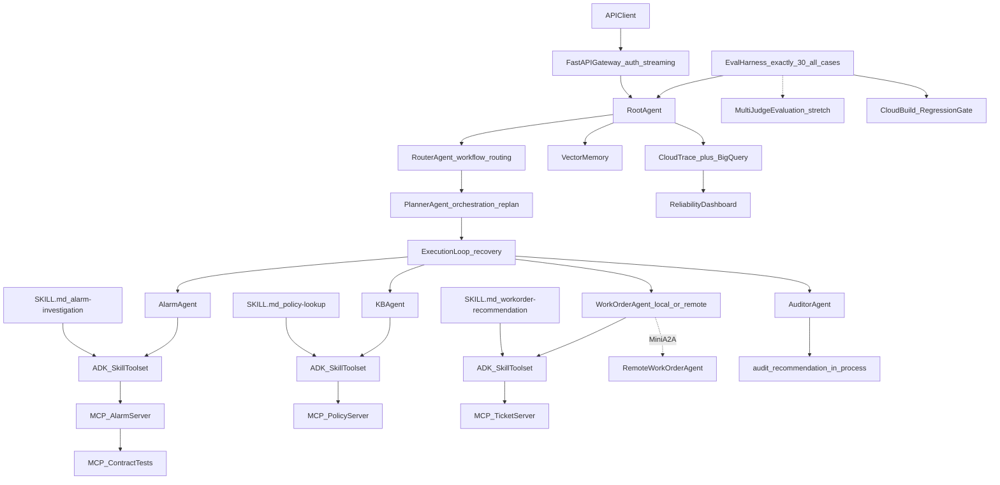

# Facility Management AgentOps - Phase 2: Distributed Agent Platform & Reliability Engineering

> **Prerequisite:** [plan_phase1.md](plan_phase1.md) V1 thin slice has been completed (Build -> Evaluate -> Deploy -> Release)
> **Follow-up:** [plan_phase3.md](plan_phase3.md) Retrieval intelligence + Execution Memory + Plan->Check->Act (without stacking more Agents)
> **North star:** [doc/plan.md](doc/plan.md) Complete Facility Management AgentOps Vision
> **Status:** Phase 2 core is complete. Sprint 6 vector memory and Sprint 7 Mini A2A are shipped; Sprint 8 Multi-Judge Evaluation remains optional stretch work.

**Positioning in one sentence:** Phase 2 upgraded the Phase 1 demo into a distributed agent platform that is **deployable, observable, evaluable, and able to block bad releases**. Its focus was **agent platformization and reliability**, not accumulating every possible technology.

**Phase 2 only answers one question:**

> How does this system go from V1 thin slice to an agent platform that can be deployed, monitored, evaluated, and blocked against bad versions?

---

## 1. Phase 2 Goals and outcome

V1 proved that the primary workflow could run, be evaluated, and be deployed. Phase 2 then delivered the core **production-grade reliability** scope described below. The tables retain the original V1-to-Phase-2 framing.

### 1.1 Main Line (Must-have - 4 items)

| Goals | V1 Current Status | Phase 2 Goals |
|------|---------|--------------|
| **Release** | shell script gate (absolute threshold) | Cloud Build CI gate + **regression comparison** |
| **Tools** | In-process Tool Registry | 3 independent MCP servers + **contract tests** |
| **Observable** | JSONL trace | Cloud Trace + BigQuery + **reliability dashboard** |
| **Eval** | 5 cases + single LLM judge | Exactly 30 `all` cases, including failure cases, + **failure recovery** metrics |

### 1.2 Core Platform Extensions (Core mainline, Sprint 5-5.5)

| Goals | V1 Current Status | Phase 2 Goals |
|------|---------|--------------|
| Orchestration | `SequentialAgent` fixed pipeline | Router + Planner dynamic routing and replan |
| Skills | None | ADK Agent Skills (SKILL.md + SkillToolset, load_skill activation tool on demand) |

### 1.3 Stretch (Important, not grabbing the main line, Sprint 6-8)

| Goals | V1 Current Status | Phase 2 Goals |
|------|---------|--------------|
| Memory | JSON keyword retrieval | FAISS or Vertex Vector Search + retrieval quality eval |
| Collaboration | Single Cloud Run Service | **Mini A2A**: Root -> remote WorkOrder Agent |
| Judge | Single LLM judge | **Multi-Judge Evaluation**:Correctness + Groundedness + Arbiter |

### 1.4 Optional (does not affect Phase 2 mainline acceptance)

| Goal | Description |
|------|------|
| IaC Hardening | Terraform environment (currently use `gcloud`/`scripts/deploy.sh` for manual/script deployment) |

---

## 2. Current Phase 2 architecture



> Router classifies the workflow intent. Planner creates the three-step plan. Root then runs the specialist pipeline inside a bounded execution loop, where the recovery gate can request one replan pass after a retryable tool failure. Specialist business tools are activated through `SKILL.md -> ADK SkillToolset -> MCP-backed tool`; there is no separate custom `SkillsRegistry` node.

---

## 3. Step-by-step execution plan (Core: Sprint 1-5.5, about 5 weeks; Stretch: Sprint 6-8, additional as needed)

> **Principle:** CI gate is meaningless without high-quality eval cases. Define failure cases and metrics schema first, and then build the gate; observability serves reliability management, not "connected to BigQuery".

### Sprint 1 - Eval Schema & Failure Cases (Week 1)

| Step | Task | Output | Acceptance |
|------|------|------|------|
| 2.1.1 | Extend eval schema | `eval_harness/metrics/schema.py` | Cover task_success, tool_call_accuracy, tool_arg_accuracy, groundedness, latency, and failure_recovery |
| 2.1.2 | Failure case data set | `golden_dataset/failure_cases.json` | tool fail / timeout / invalid arg / safety / fallback each ≥2 case |
| 2.1.3 | RAG + safety cases | `golden_dataset/rag_cases.json`, `safety_cases.json` | Exactly 30 cases in `dataset=all` |
| 2.1.4 | Failure recovery indicator | `eval_harness/metrics/scorer.py` | Replan/fallback can be quantified after injecting tool error |
| 2.1.5 | Versioned baseline reports | `eval_harness/baselines/v1-thin-slice.json`, `phase2-mcp.json` | See "Versioned baseline design" below, V1 5 case + new cases have baseline scores |

**Versioned baseline design (replaces single `baseline.json`):**

```
eval_harness/baselines/
  v1-thin-slice.json # V1 5 case baseline
  phase2-mcp.json # Sprint 3 MCP post-migration baseline
  phase2-planner.json # Sprint 5 Router/Planner baseline after rollout
  phase2-adk-skills.json # Sprint 5.5 ADK Skills baseline after full migration
```

In addition to the eval score, each baseline file records at least:

| Field | Description |
|------|------|
| `git_sha` | The commit hash when generating the baseline, ensuring traceability/reproducibility |
| `dataset_version` | Corresponding golden dataset version/case quantity snapshot |
| `model` / `model_settings` | The model name used and key inference parameters (temperature, etc.) |
| `google-adk` version | ADK library version to avoid misjudgment of cross-version behavior differences as regression |
| `skill_versions` | A snapshot of the `version` field for each `SKILL.md` (if applicable) |
| `timestamp` | Generation time |

Regression gate (Sprint 2) compares the latest milestone baseline by default (instead of a fixed file name). When adding a baseline file, you need to explicitly update the baseline path referenced in `eval_harness/gates/regression_rules.yaml`.

### Sprint 2 - Cloud Build CI + Regression Gate(Week 2)

| Step | Task | Output | Acceptance |
|------|------|------|------|
| 2.2.1 | Cloud Build pipeline | `deployment/cloudbuild-ci.yaml` | push -> eval -> gate -> deploy |
| 2.2.2 | Absolute threshold gate | `eval_harness/gates/absolute_rules.yaml` | task_success ≥ 0.85, tool_call_accuracy ≥ 0.90, etc. |
| 2.2.3 | **Regression gate** | `eval_harness/gates/regression_rules.yaml` | The new version cannot be significantly worse than the baseline |
| 2.2.4 | Gate integration | Cloud Build step | Change prompt -> BLOCK; after repair -> PASS |
| 2.2.5 | Nightly eval | CI schedule | No silent regression for 7 days |

**Regression gate rule example:**

```yaml
regression_rules:
  task_success_drop: "<= 0.03"
  groundedness_drop: "<= 0.03"
  p95_latency_increase: "<= 0.20"
  critical_failures_new: "== 0"
```

### Sprint 3 - MCP Tool Servers + Contract Tests(Week 3)

| Step | Task | Output | Acceptance |
|------|------|------|------|
| 2.3.1 | MCP alarm server | `mcp_servers/alarm/` | ADK agent calls `search_alarm_history` through MCP |
| 2.3.2 | MCP policy server | `mcp_servers/policy/` | `search_policy_doc` independent process |
| 2.3.3 | MCP ticket server | `mcp_servers/ticket/` | `recommend_work_order` independent process |
| 2.3.4 | Registry migration | `tools/registry.py` -> MCP client | Local + Cloud Run joint debugging |
| 2.3.5 | **MCP contract tests** | `tests/mcp_contract/` | schema, required args, error response all passed |

**Contract test coverage:**

- missing required arg -> clean error (non-crash)
- invalid `asset_id` -> structured error
- tool timeout -> retryable error
- valid request -> structured response

### Sprint 4 - Observability Platform(Week 4)

| Step | Task | Output | Acceptance |
|------|------|------|------|
| 2.4.1 | Cloud Trace integration | `observability/tracing/` | agent/tool ​​span synchronization to Cloud Trace |
| 2.4.2 | BigQuery export | `observability/analytics/bigquery_exporter.py` | trace + eval result can be queried by SQL |
| 2.4.3 | Structured logging | `observability/logging/structured_logger.py` | trace_id through request |
| 2.4.4 | **Reliability dashboard** | `observability/dashboard/` | See indicator definitions below |

**Dashboard metrics (must be visible):**

| Indicators | Purpose |
|------|------|
| p50 / p95 latency | Performance SLA |
| tool error rate | tool stability |
| judge pass rate | quality trend |
| release gate pass/fail | Release health |
| top failing eval cases | directed repair |
| cost estimate per request | cost control |
| fallback rate | Frequency of degraded execution |
| failure recovery rate | replan success rate |

### Sprint 5 - Router/Planner + Failure Recovery(Week 5)

| Step | Task | Output | Acceptance |
|------|------|------|------|
| 2.5.1 | RouterAgent intent classification | `agents/router_agent/` | Correct routing alarm/policy/wo process |
| 2.5.2 | PlannerAgent dynamic plan | `agents/planner_agent/` | Generate 3-step plan based on intent |
| 2.5.3 | Root from Sequential -> Orchestration | `agents/root_agent/` | V1 eval does not degrade |
| 2.5.4 | Failure recovery | replan on tool error | Sprint 1 failure cases pass rate improvement |

### Sprint 5.5 - ADK Agent Skills (Week 5, parallel to or immediately following 5)

Use native ADK Agent Skills (`SKILL.md` + `SkillToolset`) instead of a custom registry. Implement the **alarm vertical slice** first, then migrate the remaining skills after that slice passes.

| Step | Task | Output | Acceptance |
|------|------|------|------|
| 2.5.5 | ADK skill directory specification | `skills/alarm-investigation/SKILL.md` | `load_skill_from_dir` is loaded and is the only source defined for this skill |
| 2.5.6 | Loader dual format + fail-fast | `skills/loader.py` | Compatible with legacy `skill.yaml`; double configuration in the same directory or ID conflict will directly report an error |
| 2.5.7 | SkillToolset access | `tools/registry.py` | When `USE_ADK_SKILLS` is turned on, business tools are only provided through the `additional_tools` pool, without repeated exposure |
| 2.5.8 | Eval cases external | `eval_harness/skill_cases/<skill>.json` | Skill eval no longer relies on the case list in the skill definition file |
| 2.5.9 | Activation and trace verification | `tests/test_adk_skill_activation.py` | `load_skill` is actually called, the tool activation sequence is correct, and the trace contains the skill field |

**Key mechanism (source code level confirmation, google-adk 2.2.0):**

- `allowed-tools` is just a pre-authorized declaration of the agentskills.io specification layer; ADK dynamic activation reads `metadata.adk_additional_tools` and resolves it by tool name from the `SkillToolset(additional_tools=...)` pool
- Business tools appear in the tool list only after `load_skill` is written to state `_adk_activated_skill_<agent>`
- `SkillToolset` only injects general skill usage instructions; the text of SKILL.md requires the model to call `load_skill` and then enter the context with tool response

**Acceptance layer:**

*alarm vertical slice Done (this time range)*

1. `skills/alarm-investigation/SKILL.md` passes ADK verification and is the only definition source of this skill
2. When `USE_ADK_SKILLS` is turned off, the alarm-related unit tests and eval are the same as before migration (no degradation)
3. When `USE_ADK_SKILLS` is turned on, `load_skill` is actually called and returns SKILL.md instructions, and the business tool only appears after activation.
4. Skill name / version / load result can be found in trace
5. `eval_harness/skill_cases/alarm-investigation.json` drives skill-level eval through

*Phase 2 Final Acceptance*

- The three skills `alarm-investigation`, `policy-lookup` and `work-order-recommendation` are all migrated to ADK specifications
- Legacy `skill.yaml` branch in `skills/loader.py` removed
- Each of the three skills has external eval case files and activation tests

> **Significance:** Upgrade from multi-agent workflow to **agent platform with reusable skills** - Directly align with ADK / agentskills.io open specifications instead of self-made formats.

### Sprint 6 - Vector Memory & Retrieval Quality(Week 6)

**Scope (deliberately convergent):** Only semantic retrieval quality, does not involve A2A, does not involve multi-judge. The focus of acceptance is **retrieval quality**, not "as long as it can be found".

| Step | Task | Output | Acceptance |
|------|------|------|------|
| 2.6.1 | Embedding pipeline | `memory/embeddings.py` | case vectorizable (batch + single) |
| 2.6.2 | Vector index | FAISS or Vertex Vector Search | `memory/vector_store.py` supports library building/incremental writing |
| 2.6.3 | Upgrade `search_similar_cases` | `memory/session_store.py` / corresponding tool | Switch from keyword search to semantic search while retaining a fallback path |
| 2.6.4 | Retrieval-specific eval cases | `golden_dataset/retrieval_cases.json` | Cover paraphrases, cross-terminology matching, and low scores for irrelevant cases |
| 2.6.5 | **Retrieval quality metrics** | `eval_harness/metrics/retrieval_scorer.py` | Output Recall@K, relevance score, downstream groundedness changes |

**Acceptance criteria (not "can be found", but "can be found correctly"):**

- Recall@K (e.g. K=3) has a clear baseline value on retrieval eval cases
- Cases that are semantically related but have non-overlapping keywords can be retrieved (proven that they do not degenerate into keyword matching)
- After introducing vector search, the downstream groundedness score is not lower than the keyword search baseline (regression gate is optionally included)
- Excludes: A2A split, multi-judge, Terraform

### Sprint 7 - Mini A2A & Distributed Reliability(Week 7)

**Scope (deliberately constrained):** Deploy only **one** remote agent (WorkOrder) to verify the A2A contract and cross-service reliability; do not split every specialist into a separate service.

| Step | Task | Output | Acceptance |
|------|------|------|------|
| 2.7.1 | Remote WorkOrder Agent | `agents/workorder_agent/` Standalone service | Can be started independently, exposing A2A endpoint |
| 2.7.2 | Agent Card | `deployment/a2a/agent_card.json` | Describe capabilities, input and output schema, comply with A2A specifications |
| 2.7.3 | Root -> remote call | `agents/root_agent/` | Root calls remote WorkOrder Agent through A2A client, replacing local direct call |
| 2.7.4 | Trace_id is propagated across services | `observability/tracing/` | The span of Root and remote agent can be queried with the same trace_id association |
| 2.7.5 | Timeout/unavailable/invalid response processing | `agents/root_agent/recovery.py` or equivalent module | Each of the three types of failures has a clear retry strategy and fallback (such as downgrading local execution or returning a controllable error) |
| 2.7.6 | **A2A integration / contract tests** | `tests/a2a_contract/` | Agent card verification, normal calls, timeouts, unavailability, and illegal responses are all covered by tests |

**Acceptance Criteria:**

- Only one agent becomes remote; all other agents remain in-process.
- trace_id can be used to concatenate the call chain of Root and remote WorkOrder in Cloud Trace / BigQuery
- Artificially injected timeouts/service unavailable/illegal responses trigger expected retry or fallback instead of unhandled exceptions
- Sprint 1 only defined the general failure-case framework (tool fail/timeout/invalid arg/safety/fallback). This sprint added A2A-specific timeout/unavailable/invalid-response cases within this framework and met the pass rate requirements.

### Sprint 8 - Multi-Judge Evaluation Hardening(Week 8)

That is, the "Lightweight Debate Judge" in the original plan is more accurately named **Multi-Judge Evaluation** - not a real multi-agent debate loop, but an evaluation process of multiple independent judges + one arbiter.

| Step | Task | Output | Acceptance |
|------|------|------|------|
| 2.8.1 | Correctness Judge | `eval_harness/judges/correctness_judge.py` | Score independently from the existing groundedness judge |
| 2.8.2 | Groundedness Judge | `eval_harness/judges/groundedness_judge.py` | Split out the existing judge into an independent, single-testable component |
| 2.8.3 | Arbiter | `eval_harness/judges/arbiter.py` | Combine the scores and reasons of the two judges and output the final PASS/FAIL |
| 2.8.4 | Judge disagreement analysis | `eval_harness/metrics/judge_analysis.py` | Statistics of the proportion and typical patterns of cases with inconsistent scores between two judges |
| 2.8.5 | Cost/latency analysis | Same as above or independent report | Record the additional token/latency overhead of multi-judge compared to single judge |
| 2.8.6 | Judge disagreement eval cases | `golden_dataset/judge_disagreement_cases.json` | Covers scenarios where judge is prone to disagreement (such as partial correctness, indirect citation of sources, etc.) |

**Architecture (not complete multi-agent debate):**

```
Correctness Judge ──┐
                    ├──► Arbiter -> PASS/FAIL + disagreement flag
Groundedness Judge ─┘
```

**Acceptance Criteria:**

- The two judges can run and test independently, and the Arbiter logic is decoupled from the two.
- The report includes disagreement rate, average additional cost/latency
- Clearly does not implement a real multi-round debate loop (judges do not convince each other/iterate)

Interview narrative: *"I added a multi-judge evaluation path to reduce single-judge bias, starting with correctness and groundedness judges plus an arbiter, and measured the disagreement rate and cost/latency overhead it introduced."*

---

## 3.1 Stretch / Optional IaC Hardening

Not on the Sprint 6/7/8 mainline, only if there is margin:

| Step | Task | Output | Acceptance |
|------|------|------|------|
| S.1 | Terraform environment | `infra/terraform/` | Cloud Run / Artifact Registry / BigQuery and other resources can be reproduced through `terraform apply` |

---

## 4. Added Repo structure (Phase 2)

```
fm-agentic-e2e-gcp/
  plan_phase2.md
  agents/
    router_agent/
    planner_agent/
    workorder_agent/          # Sprint 7: Mini A2A remote service
  mcp_servers/
    alarm/
    policy/
    ticket/
  skills/
    alarm-investigation/ # ADK specification
      SKILL.md
      references/ # optional
    policy-lookup/SKILL.md
    workorder-recommendation/SKILL.md
    loader.py
  memory/
    embeddings.py             # Sprint 6
    vector_store.py           # Sprint 6
  observability/
    tracing/
    analytics/bigquery_exporter.py
    logging/structured_logger.py
    dashboard/
  eval_harness/
    baselines/
      v1-thin-slice.json
      phase2-mcp.json
      phase2-planner.json
      phase2-adk-skills.json
    metrics/
      schema.py
      retrieval_scorer.py     # Sprint 6
      judge_analysis.py       # Sprint 8
    gates/
      absolute_rules.yaml
      regression_rules.yaml
    golden_dataset/
      failure_cases.json
      safety_cases.json
      rag_cases.json
      retrieval_cases.json          # Sprint 6
      judge_disagreement_cases.json # Sprint 8
    judges/
      correctness_judge.py    # Sprint 8
      groundedness_judge.py   # Sprint 8
      arbiter.py               # Sprint 8
    skill_eval.py
    skill_cases/
      alarm-investigation.json
      policy-lookup.json
      workorder-recommendation.json
  tests/
    mcp_contract/
    a2a_contract/              # Sprint 7
  deployment/
    cloudbuild-ci.yaml
    a2a/
      agent_card.json          # Sprint 7
  infra/
    terraform/                 # Stretch / Optional IaC Hardening
```

---

## 5. Phase 2 Done Checklist

### 5.1 Core Done (main line: Agent Platformization + Reliability, must be completed)

1. ✅ The `dataset=all` eval suite contains exactly **30 cases**: 10 normal alarm, 5 safety, 5 RAG, and 10 tool-failure/fallback cases.
2. ✅ Metrics include task success, tool-call accuracy, tool-argument accuracy, groundedness, latency, and **failure recovery**.
3. ✅ Cloud Build implements **push -> eval -> regression gate -> deploy** and blocks a bad prompt.
4. ✅ Three MCP-style tool servers run independently and pass **contract tests**.
5. ✅ Cloud Trace + BigQuery provide queryable agent/tool/eval telemetry, and the reliability dashboard exposes latency, error rate, judge score, and release results.
6. ✅ Router + Planner provide intent routing, three-step planning, and bounded replanning without regressing the V1 workflow.
7. ✅ **ADK Agent Skills**: `alarm-investigation`, `policy-lookup`, and `workorder-recommendation` use `SKILL.md`; `load_skill` loads instructions and activates business tools on demand.

### 5.2 Stretch Done (Extension: verification breadth, non-mainline mandatory)

8. **Vector memory** (Sprint 6): Semantic retrieval of similar resolved cases, and retrieval-specific indicator baselines such as Recall@K / relevance
9. **Mini A2A** (Sprint 7): At least 1 remote A2A agent (WorkOrder) can be called by Root Agent, **trace_id is passed across services**, timeout/unavailable/invalid response has retry/fallback and has contract tests
10. **Multi-Judge Evaluation** (Sprint 8): Correctness + Groundedness judge + Arbiter run independently, with disagreement rate and cost/latency analysis
11. IaC Hardening (Optional): Terraform environment can be reproduced

> Sprints 6, 7, and 8 are independent and may be selected individually. Section 5.1 defines Phase 2 core completion; the stretch items in Section 5.2 are not required for Phase 2 core status.

---

## 6. Coverage with plan.md

| plan.md Technical points | V1 | Phase 2 | Belonging to Sprint |
|----------------|-----|---------|-------------|
| Multi-agent orchestration | SequentialAgent | Router + Planner + replan | Sprint 5(Core) |
| Agent Skills | None | ADK Agent Skills (SKILL.md + SkillToolset) + skill-level eval | Sprint 5.5 (Core) |
| MCP tools | in-process | standalone servers + contract tests | Sprint 3 (Core) |
| Tracing | JSONL | Cloud Trace + BQ + dashboard | Sprint 4(Core) |
| Eval | 5 cases | Exactly 30 `all` cases; optional specialist datasets load separately | Sprint 1 (Core) + later stretch sprints |
| Release Gate | shell (absolute threshold) | Cloud Build CI + **regression gate** | Sprint 2 (Core) |
| Memory | JSON keyword | vector search + retrieval quality eval | Sprint 6(Stretch) |
| A2A | None | **Mini A2A** (1 remote agent) + cross-service trace/retry/fallback | Sprint 7 (Stretch) |
| Judge | Single LLM judge | **Multi-Judge Evaluation** (Correctness + Groundedness + Arbiter) | Sprint 8 (Stretch) |
| IaC | Manual/Scripted Deployment | Terraform (optional) | Stretch/Optional |
| Post-training | None | SFT/DPO placeholder | **Phase 3 Sprint 14** (eval flywheel; training optional) |

---

## 7. Historical implementation order

If resources are limited, strictly follow this priority (**CI gate must have eval schema**); 1-6 is the Core main line, 7-9 is Stretch, and 10 is Optional:

**Core(Sprint 1-5.5)**

1. **Expanded eval schema + failure cases, exactly 30 `all` cases** - the foundation of the gate
2. **Cloud Build CI gate + regression comparison** - Maximum release value
3. **MCP servers + contract tests** - Tools are decoupled and provably stable
4. **Cloud Trace + BigQuery observability + dashboard** - reliability management
5. **Router + Planner replan** - Align the architectural vision without competing for the main line
6. **ADK Agent Skills** - workflow -> platform (first alarm vertical slicing, then migrate policy-lookup / workorder-recommendation)

**Stretch (Sprint 6-8, independent of each other, in any order)**

7. **Sprint 6 - Vector memory & retrieval quality** - Improve RAG quality, check Recall@K / relevance for acceptance
8. **Sprint 7 - Mini A2A & distributed reliability** - deploy only WorkOrder remotely, including timeout and fallback handling
9. **Sprint 8 - Multi-Judge Evaluation Hardening** - Reduce single-judge bias, including disagreement/cost analysis

**Optional**

10. **IaC Hardening (Terraform)** - The environment is reproducible without affecting the core narrative

---

## 8. Reference links

- [ADK MCP Tools](https://google.github.io/adk-docs/tools/mcp-tools/)
- [ADK Agent Skills](https://google.github.io/adk-docs/skills/)
- [Agent Skills Open Specification](https://agentskills.io/specification)
- [ADK A2A](https://google.github.io/adk-docs/a2a/)
- [Vertex Vector Search](https://cloud.google.com/vertex-ai/docs/vector-search/overview)
- [Cloud Build](https://cloud.google.com/build/docs)
- [ADK Eval Codelab](https://codelabs.developers.google.com/adk-eval/instructions)

---

## 9. Next step: Phase 3

Phase 2 made the system a platform that can be deployed, observed, evaluated, and protected from bad releases.
Phase 3 is documented in [plan_phase3.md](plan_phase3.md); it improves retrieval, memory, and control loops without adding more specialist agents.

Core constraints (Google 180-config agent scaling):

> Centralized coordination can improve parallelizable tasks by about 80.9%, while multi-agent configurations degrade strictly sequential planning (PlanCraft) by 39-70%. **Newer does not mean more agents.**
