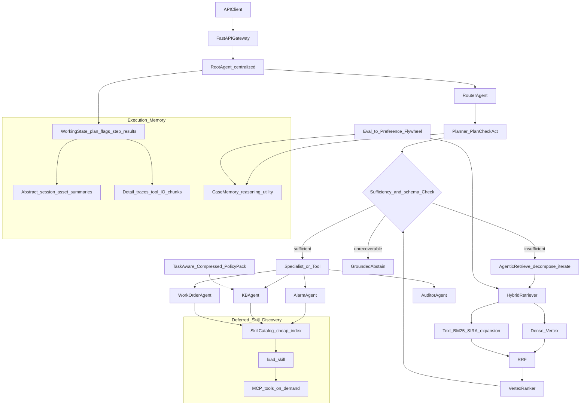

# Facility Management AgentOps - Phase 3: Retrieval Intelligence, Execution Memory & Control Loops

> **Prerequisite:** [plan_phase1.md](plan_phase1.md) V1 closed loop · [plan_phase2.md](plan_phase2.md) Platformization + Reliability  
> **North star:** [doc/plan.md](doc/plan.md) Complete Facility Management AgentOps Vision
> **Status:** Phase 3 is an active implementation plan; Phase 2 core is complete.

**Positioning in one sentence:** Phase 2 made the system a deployable, observable, evaluable agent platform that can block bad releases. Phase 3 does not add more agents; it turns **retrieval, context, memory, and control loops** into production-grade intelligence aligned with current 2026 industry research.

**Phase 3 only answers one question:**

> Without adding specialist agents, how can the system reliably "retrieve evidence -> confirm sufficiency -> act" while preserving execution state?

**Architectural constraints (must be written into Phase 3, cannot be used as an appendix):**

> **Newer does not mean more agents.** Google Research tested 180 agent configurations: multi-agent systems can improve parallelizable tasks substantially but perform significantly worse on strictly sequential planning.

---

## 0. Why Phase 3 does not add more agents

Phase 2 already has Router + Planner + four specialists + Mini A2A. Adding separate Retrieval, Sufficiency, Memory, and Compression agents in Phase 3 would confuse a larger topology with genuine progress.

Current 2026 research and product guidance points in a different direction:

| Organization / Date | Direction | Core improvement | Implication for FM AgentOps |
| ----------- | -------- | -------- | ------------ |
| **Google Research · Jun 5** | Agentic RAG + Sufficient Context | If one search is not enough, continue searching until the evidence is sufficient; if it is not enough, abstain, don’t answer hard | The search must have a sufficiency gate, not top-k and finish |
| **Meta · Jun 5** | SIRA | corpus-aware keyword expansion; even a single BM25 can defeat complex agent search | Do the **one search** right first, don't default to multi-round agent search |
| **Meta · Jul 17** | RA-RFT | Do not search by "semantic similarity", but search by "whether this case is helpful for reasoning" | similar cases should be searched by analogical / reasoning utility |
| **AWS · Jul 16/23** | Agentic Retrieval | query decomposition + multi-KB + iterative retrieve + sufficiency | Multiple databases and multiple hops will escalate into agentic loop |
| **AWS · Jul 27** | Task-Aware Knowledge Compression | Complex cross-document tasks do not even use traditional top-k chunks | Policy package/asset manual tasks use compressed views instead of fragment retrieval |
| **Google Cloud · Jul 8 docs** | Agent Retrieval + RRF + VertexRanker | Dense + Text -> RRF -> semantic reranker | The default hybrid stack on GCP, first implement it and then talk about agentic |

Plus four conclusions (not slogans) that must be written into product design:

1. **Agentic Context Management** - The context needs to be compact / offload / reload, not infinite.
2. **Deferred Tool / Skill Discovery** - Tools and skills are discovered on demand, without dumping the full schema at the beginning.
3. **Memory ≠ Vector DB** - Memory is first **Execution State**, and secondly the searchable case library; and it must be made into an "abstraction + detail" multi-layer structure.
4. **Plan -> Check -> Act**, not Plan -> Act. The replan in Phase 2 is only triggered when a tool error occurs; in Phase 3, even if the tool is successful, it must first check whether the evidence is sufficient.

**Do not assume multi-agent is always better (Google agent scaling, Jan 2026 / arXiv Dec 2025):**

Google tested **180** agent configurations (1 single-agent + 4 multi-agent topology × multi-model × multi-benchmark) in *Towards a Science of Scaling Agent Systems*:

| Task type | Represents benchmark | Result |
| -------- | -------------- | ---- |
| Can be decomposed in parallel | Finance-Agent, etc. | **centralized coordination about +80.9%** |
| Strict sequential planning | PlanCraft | Various multi-agent configurations **Down 39-70%** |

The reason is very specific: sequential tasks require continuous state; splitting the context among multiple agents will disrupt reasoning, and communication overhead eats up the cognitive budget. An independent agent will also amplify the error by about 17.2×, and centralized coordination can reduce it to about 4.4×.

**Mapped to FM AgentOps:** The HVAC main story is **strictly sequential** (check alarm -> reference policy -> decide on the work order, each step depends on the execution status of the previous step). This is more like PlanCraft than a parallel earnings split. therefore:

- **Do not** add any more specialist agents
- **Reserved** Phase 2 centralized Planner (this is the only topology in Google that has greatly increased parallel tasks and can suppress error amplification)
- **Only parallelize subqueries that are truly parallelizable** (such as independent subqueries for alarm history and policy in the same round)
- Mini A2A (Phase 2 Sprint 7) continues to only serve **distribution and reliability**, not "one more brain"

---

## 1. Phase 3 Goals

Phase 2 proved that the platform can release versions and block regressions. Phase 3 focuses on **retrieval intelligence + control loops** rather than expanding the agent topology.

### 1.1 Main Line (Must-have - 4 items)

| Goals | Phase 2 Current Status | Phase 3 Goals |
|------|--------------|--------------|
| **Retrieve** | Sprint 6: vector/keyword, one top-k | **Hybrid one-shot** (Dense + Text -> RRF -> VertexRanker) + corpus-aware expansion; multi-round is not used by default |
| **Evidence** | groundedness judge scores after execution | **Sufficient Context gate**: if evidence is insufficient, retrieve again or abstain; never make an unsupported recommendation |
| **Arrangement** | Plan -> Act, replan only after tool error | **Plan -> Check -> Act**: Check evidence/tool ​​results/policy coverage first at each step |
| **Memory** | session JSON + vector similar cases | Memory = **Execution State** + two layers of "summary / details"; context can be compact / reload |

### 1.2 Stretch (important, without displacing core work)

| Goal | Description |
|------|------|
| Reasoning-aware case retrieval | similar cases are sorted by "whether it is helpful for downstream reasoning" rather than semantic similarity (RA-RFT lite, does not train large models) |
| Task-aware knowledge compression | Cross-document policy package uses compressed view instead of traditional top-k chunks |
| Deferred skill / tool discovery | skill catalog cheap index -> ​​`load_skill` -> then expose business tools; MCP schema is also on demand |
| Self-improvement flywheel | traces -> eval failures -> preference / retrieval labels -> re-evaluation -> gate; not live multi-agent interaction |

### 1.3 Clearly do not do it

| Not to do | Reason |
|------|------|
| Add Retrieval / Sufficiency / Memory / Compression agents | Violates the "newer does not mean more agents" constraint; these are **loops and modules**, not new personas |
| Default multi-round agent search | SIRA: one corpus-aware search is often enough; agent loop only escalates on sufficiency fail |
| Treat Vector DB as all of Memory | The execution status (plan, step result, sufficiency flag) is the main memory |
| Complete RA-RFT / SFT / DPO large model training | flywheel generates data and retriever signals first; model training is an optional follow-up |
| Expand Mini A2A into 4 remote agents | Phase 2 has converged to 1 remote agent; the sequential main path should remain in-process state continuously |

---

## 2. Phase 3 architecture (target state)



> Topology is the same as Phase 2: still **a central Planner** coordinating existing specialists. New in Phase 3 are the retrieval stack, Check gate, hierarchical memory and delayed discovery - all modules, not new agents.

**Retrieval routing (write the tension of SIRA and Agentic RAG as product rules):**

```text
query
  ├─ Single intent / single KB lookup -> Hybrid one-shot (SIRA-style expansion + RRF + Ranker)
  ├─Multi-intent / multi-KB / multi-hop -> first one-shot; sufficiency fail before escalating into iterative retrieve
  └─ Cross-document synthesis (policy package/manual) -> Task-aware compressed view (Stretch), without top-k fragments
```

This is not "searching must be agentic", but: **Searching once is the default; if it is not enough, search again; if it is exhausted, it is admitted that it is not enough. **

---

## 3. Research -> Product Mapping

| Research conclusion | Product placement | Acceptance signal |
|----------|----------|----------|
| Sufficient Context (Google) | `SufficiencyCheck`: Whether the current evidence supports the goal of this step; if not, iterate or abstain | When there is insufficient evidence, it is **not** recommended to output create/escalate; trace has `sufficient=true/false` |
| SIRA (Meta) | Query side corpus-aware word expansion + document frequency filtering + weighted BM25/Text; do RRF with dense | The Recall@K of a single hybrid is not lower than the "brainless multi-round search" baseline; the latency is lower |
| Agent Retrieval + RRF + VertexRanker (GCP) | Dense + Text -> RRF -> `semantic-ranker-fast` | retrieval eval on hybrid > dense-only and text-only |
| Agentic Retrieval (AWS) | query decompose -> route by KB (alarm / policy / ticket / cases) -> iterate until sufficient | Recall improvement of multi-hop cases; `max_iterations` has an upper limit and can be stopped early |
| RA-RFT (Meta) | A similar case is positive when including it improves downstream groundedness or decision quality | Retrieve useful analogies and demote semantically similar cases that do not help reasoning |
| Task-Aware Compression (AWS) | Pre-compressed policy bundles for `alarm-investigation` / `workorder-recommendation` | Groundedness of compression view ≥ top-k RAG on cross-term synthesis issues |
| Memory = Execution State | `SESSION_KEYS` is upgraded to typed working state (plan, check, sufficiency, compacted summary) | Interrupted subsequent runs can be resumed from the working state, not just by chat transcript |
| Abstract + Detail | Hot path only carries summary; detail is loaded lazily according to step/tool ​​| Long session token decreases, but task_success does not decrease |
| Plan -> Check -> Act | Planner forces check node at each step | tool will also replan/retrieve when successful but insufficient evidence |
| Deferred discovery | Skill catalog short description is permanent; SKILL.md and tool schema are on-demand | The first round of prompts no longer contains the full text of inactive skills |
| Self-improvement flywheel | eval fail -> hard case/preference pair -> update expansion dictionary, retriever tag, prompt | same fail cluster nightly eval down in the next round |
| 180-config scaling | The main path remains centralized + sequential; only parallel independent subquery | No new agent; Finance-style parallelism is only used to retrieve subqueries |

---

## 4. Step-by-step execution plan

> **Principle:** First make sure **one retrieval** and **sufficiency** are correct, and then open the agentic loop. First make Memory into Execution State, then do compression and flywheel. CI gate continues to use Phase 2; Phase 3 only adds retrieval / sufficiency / check indicators.

### Sprint 9 - Hybrid One-Shot Retrieval(Week 1-2)

**Alignment:** Google Cloud Agent Retrieval + RRF + VertexRanker; Meta SIRA (corpus-aware expansion, not multi-round).

**Scope:** Replaces "either vector or keyword". The default path is a **once** hybrid search. Do not do iterative agent search.

| Step | Task | Output | Acceptance |
|------|------|------|------|
| 3.9.1 | Dual index | `memory/vector_store.py` + `memory/lexical_index.py` | The same corpus can be retrieved densely and BM25/Text |
| 3.9.2 | Corpus-aware expansion | `memory/query_expand.py` | LLM proposes word candidates -> uses document frequency to discard non-existent/too common words -> weighted Text query |
| 3.9.3 | RRF fusion | `memory/hybrid_retriever.py` | Dense list + Text list -> RRF; weight configurable |
| 3.9.4 | VertexRanker (or local cross-encoder fallback) | `memory/rerank.py` | Semantic reranking after RRF; return RRF results if Ranker fails |
| 3.9.5 | Upgrade `search_similar_cases` / policy search | Corresponding tool | Use hybrid retrieval by default and retain keyword fallback |
| 3.9.6 | Retrieval eval | `golden_dataset/hybrid_retrieval_cases.json` | Recall@K, MRR; compare keyword / dense-only / hybrid / "forced 3-round agent search" |

**Acceptance Criteria:**

- hybrid Recall@K > dense-only and > keyword-only (Sprint 6 baseline)
- Synonym rewriting, asset alias (AHU vs air handler), policy clause number can be hit
- **Mandatory multi-round agent search shall not be used as the default**; it is only used as an eval comparison to prove whether the SIRA conclusion is true on this corpus
- When Ranker is unavailable, the system still returns RRF results without crashing

### Sprint 10 - Sufficient Context + Conditional Agentic Retrieve(Week 3-4)

**Alignment:** Google Agentic RAG + Sufficient Context; AWS Agentic Retrieval (decompose + multi-KB + iterate + sufficiency).

**Scope:** Add **Check** on top of Sprint 9. Only sufficiency fail will enter iterative retrieve. Not every question is agentic.

| Step | Task | Output | Acceptance |
|------|------|------|------|
| 3.10.1 | Sufficiency schema | `retrieval/sufficiency.py` | `{sufficient, missing, next_query, reason}`; autorater can be single tested |
| 3.10.2 | Query decomposition | `retrieval/decompose.py` | Split multiple intentions into sub-queries and mark them with target KB (alarm/policy/ticket/cases) |
| 3.10.3 | Iterative retrieve loop | `retrieval/agentic_loop.py` | `max_iterations` (single KB=3, multiple KB=4-5); stop when enough |
| 3.10.4 | Grounded abstain | Planner / Auditor | Still not enough -> Make it clear that "there is insufficient evidence to recommend building an order" and fabrication is prohibited |
| 3.10.5 | Trace field | `observability/tracing/models.py` | `retrieval_mode`, `iterations`, `sufficient`, `kbs_hit` |
| 3.10.6 | Sufficiency eval | `golden_dataset/sufficiency_cases.json` | Four categories: sufficient / insufficient but recoverable through retrieval / insufficient after search exhaustion / correct abstention |

**Acceptance Criteria:**

- Single-shot lookup **does not** enter iterative loop (mode=`hybrid_oneshot`)
- Multi-hop/multi-KB cases escalate after sufficiency fail, and most of them stop within `max_iterations`
- In the case of "Nothing can be found even after searching": the system abstains, and the task is recorded as correct abstain instead of wrong recommendation.
- After introducing loop, p95 latency has an upper limit; regression gate increases `sufficiency_abstain_precision`

### Sprint 11 - Execution Memory + Layered Context(Week 5)

**Alignment:** Memory = Execution State; Abstract + Detail; Agentic Context Management.

**Scope:** Don’t think of Memory as “another Vector DB”. Working state is the hot path; vector/hybrid is just an index into case/policy.

| Step | Task | Output | Acceptance |
|------|------|------|------|
| 3.11.1 | Typed working state | `memory/execution_state.py` | plan, current_step, check_result, sufficiency, tool_errors, compacted_summary |
| 3.11.2 | Write to existing `SESSION_KEYS` | `memory/session_store.py` | Snapshots can be restored from working state, do not rely on full transcript |
| 3.11.3 | Abstract vs detail | `memory/layers.py` | abstract = assets/session conclusion; detail = tool I/O and retrieved chunks, lazy loading by key |
| 3.11.4 | Context compact | `memory/compact.py` | When the threshold is exceeded, the detail of the completed step is folded into summary, and the detail is external |
| 3.11.5 | Reload on demand | Planner Check | When Check detects missing detail, reload it through `state_ref` instead of keeping the full log in the prompt |
| 3.11.6 | Memory eval | `golden_dataset/memory_state_cases.json` | Task_success does not decrease after interrupting subsequent runs and long session compaction |

**Acceptance Criteria:**

- Interrupt subsequent runs: only give working state + abstract, and you can still enter the next step correctly.
- Long session prompt token decreases relative to Phase 2 baseline (target ≥ 30%), but groundedness does not decrease
- Vector index is the retrieval backend for case/policy, not the only implementation of session memory
- trace can distinguish `memory_layer=working|abstract|detail`

### Sprint 12 - Plan -> Check -> Act + Deferred Discovery(Week 6)

**Alignment:** Plan -> Check -> Act; Deferred Tool / Skill Discovery. Google scaling: The main path remains centralized sequential.

**Scope:** Phase 2 Planner replans when tool **fails**. Phase 3 also needs to be checked when the tool is successful but the evidence is insufficient/the schema is incomplete/the skill that should not be activated is activated**. No new agent is added.

| Step | Task | Output | Acceptance |
|------|------|------|------|
| 3.12.1 | Check node | `agents/planner_agent/check.py` | Check before each step of Act: whether the target is covered, sufficiency, tool schema, safety |
| 3.12.2 | Check result-driven | `agents/planner_agent/plan.py` | `continue` / `retrieve_again` / `replan` / `abstain` / `compact_and_continue` |
| 3.12.3 | Parallelism is limited to independent subquery | Planner | For example, alarm history and unrelated policy lookup can be parallelized; **Decision steps must be serial** |
| 3.12.4 | Skill catalog resident, text on demand | `skills/loader.py` | Only id/description/match_hints is injected by default; SKILL.md is entered after `load_skill` |
| 3.12.5 | Tool schema on demand | `tools/registry.py` | MCP schema without activated skill will not enter the first round of prompts |
| 3.12.6 | Control-loop eval | `golden_dataset/plan_check_act_cases.json` | Insufficient evidence does not allow Act; error skill is not loaded; parallelism does not destroy sequential dependencies |

**Acceptance Criteria:**

- V1 / Phase 2 eval does not degrade
- "The tool returned but the policy did not cover the asset type" -> Check to block, then search or abstain instead of recommend directly
- The first round of prompts does not include instructions and tool schema for unactivated skills.
- **Not** add specialist; A2A still has at most 1 remote (WorkOrder)
- The interview can clarify: *Sequential main path uses a Planner to do Check; parallelism only occurs in retrieval subqueries*

### Sprint 13 - Reasoning-Aware Cases + Task-Aware Compression(Stretch)

**Alignment:** Meta RA-RFT; AWS Task-Aware Knowledge Compression.

**Deliberate restraint:** Do not train LLM. Only train/tune the sorting signal of **case retriever**; compression is only for stable policy packages and does not perform full-database KV cache.

| Step | Task | Output | Acceptance |
|------|------|------|------|
| 3.13.1 | Reasoning-utility labels | `eval_harness/retrieval_labels.py` | Positive sample = the downstream decision-making/groundedness becomes better after adding this case |
| 3.13.2 | Case ranker | `memory/case_ranker.py` | Ranking = f(hybrid score, reasoning utility), with hybrid-only fallback |
| 3.13.3 | Analogical eval | `golden_dataset/analogy_cases.json` | Rank superficially different cases with the same failure mode in the top-k; demote semantically similar but unhelpful cases |
| 3.13.4 | Policy package compression view | `knowledge/compressed_packs/` | One task-specific brief each for alarm-investigation / workorder-recommendation |
| 3.13.5 | Query routing | KB Agent | lookup -> hybrid chunks; cross-term synthesis -> compressed pack + reference back to the source (RAG can be used to supplement the audit chain) |

**Acceptance Criteria:**

- analogical cases: downstream groundedness ≥ semantic similarity baseline
- Cross-document policy question: correct citation rate of compressed pack ≥ top-k RAG
- When audit traceability is required, the compressed answer can still point back to the original terms (TAKC + RAG combination, not one of the two)

### Sprint 14 - Self-Improvement Flywheel(Stretch)

**Alignment:** Self-play / self-improvement; unscheduled post-training in `doc/plan.md`; RA-RFT "retrieval as orthogonal improvement axis".

**Scope:** Do the **data and retrieval flywheel** first, do not do live multi-agent interaction, and do not train large models all at once.

```text
prod/eval traces
  -> fail clusters(sufficiency miss / bad case / wrong skill / weak check)
  -> Synthetic hard example + preference pair (chosen = grounded+sufficient, rejected = hard recommendation)
  -> Updated: expansion dictionary / case utility tag / Check prompt
  -> Optional: SFT/DPO small model (only if flywheel data is stable)
  -> Run eval harness + regression gate again
```

| Step | Task | Output | Acceptance |
|------|------|------|------|
| 3.14.1 | Fail cluster mining | `post_training/clusters.py` | Attribution from BigQuery/JSONL to retrieval/check/memory/skill |
| 3.14.2 | Preference data | `post_training/preference_data/` | Failure per category ≥ N pairs chosen/rejected |
| 3.14.3 | Offline updater | `post_training/flywheel.py` | Can update expansion stopwords, case labels, check rubric; has dry-run |
| 3.14.4 | Gate integration | regression_rules | Flywheel updates also go through Phase 2 gate; bad updates automatically BLOCK |
| 3.14.5 | Optional SFT/DPO | `post_training/sft/` `dpo/` | Has data format and training script placeholders; not Sprint 14 completion definition |

**Acceptance Criteria:**

- At least one real fail cluster after flywheel nightly eval down
- All flywheel products are versioned (consistent with `git_sha` / `dataset_version` of Phase 2 baseline)
- **Not** Multiple agents debate each other to "self-evolve"; self-improvement comes from the eval signal

---

## 5. Added Repo structure (Phase 3)

```
fm-agentic-e2e-gcp/
  plan_phase3.md
  retrieval/
    sufficiency.py          # Sprint 10
    decompose.py            # Sprint 10
    agentic_loop.py         # Sprint 10
  memory/
    lexical_index.py        # Sprint 9
    query_expand.py         # Sprint 9
    hybrid_retriever.py     # Sprint 9
    rerank.py               # Sprint 9
    execution_state.py      # Sprint 11
    layers.py               # Sprint 11
    compact.py              # Sprint 11
    case_ranker.py          # Sprint 13
  knowledge/
    compressed_packs/       # Sprint 13
  agents/planner_agent/
    check.py                # Sprint 12
  post_training/            # Sprint 14
    clusters.py
    preference_data/
    flywheel.py
    sft/                    # optional
    dpo/                    # optional
  eval_harness/
    golden_dataset/
      hybrid_retrieval_cases.json
      sufficiency_cases.json
      memory_state_cases.json
      plan_check_act_cases.json
      analogy_cases.json
    baselines/
      phase3-hybrid.json
      phase3-sufficiency.json
      phase3-check.json
```

---

## 6. Phase 3 Done Checklist

### 6.1 Core Done (must be completed)

1. **Hybrid one-shot retrieval**: Dense + corpus-aware Text -> RRF -> Ranker; keyword / dense-only has control baseline
2. **Sufficient Context**: If insufficient, iterate or abstain; single intent will not enter agentic loop by default
3. **Execution Memory**: typed working state + summary/detail layering + compact/reload; interruption of subsequent runs can be resumed
4. **Plan -> Check -> Act**: The tool will be blocked if it is successful but there is insufficient evidence; the decision steps are serial; only independent subquery can be parallelized
5. **Deferred discovery**: The text and tool schema of the inactive skill will not enter the first round of prompts.
6. **No new specialist agent**; A2A still has a maximum of 1 remote; V1 / Phase 2 eval does not degrade
7. Regression gate adds retrieval / sufficiency / check indicators, bad update BLOCK

### 6.2 Stretch Done (can only do part of it)

8. Reasoning-aware similar cases (utility tag, not pure semantics)
9. Task-aware compressed policy packs (cross-document questions ≥ top-k RAG, and traceable)
10. Self-improvement flywheel (at least open traces -> data -> update -> gate; SFT/DPO optional)

---

## 7. Coverage with Phase 2 / plan.md

| Technical Points | Phase 2 | Phase 3 |
|--------|---------|---------|
| Orchestration | Router + Planner + replan-on-error | **Plan -> Check -> Act**; Parallel only independent retrieval |
| Skills | ADK `load_skill` | **Deferred discovery**: catalog resident, text/schema on-demand |
| Memory | JSON + vector similar cases | **Execution State** + abstraction/detail layer + compact |
| Retrieval | Vector quality(Recall@K) | Hybrid RRF + Ranker + SIRA expansion + sufficiency loop |
| Similar cases | Semantic similarity | Stretch: reasoning utility (RA-RFT lite) |
| Knowledge | top-k chunks | Stretch:task-aware compressed packs |
| A2A | Mini A2A 1 remote | **No more agent expansion**; remote is only for reliability |
| Post-training | Not scheduled | Stretch: eval flywheel; SFT/DPO placeholder |
| Unnecessary multi-agent expansion | Router/Planner were added during platformization | Apply the Google 180-configuration result: do not split the sequential main path across more reasoning agents |

---

## 8. Suggested starting order

If resources are limited, strictly follow this priority (**one-shot retrieval first, then agentic loop**):

**Core**

1. **Sprint 9 Hybrid one-shot** - proves “one search is right”; the comparison of SIRA vs blind agent search is here
2. **Sprint 10 Sufficiency + conditional agentic retrieve** - If it is not enough, search again, and if it is exhausted, abstain
3. **Sprint 11 Execution memory** - Memory changes from Vector DB to resumable execution state
4. **Sprint 12 Plan -> Check -> Act + deferred discovery** - closed control loop; no instrumental personality added

**Stretch**

5. **Sprint 13 Reasoning-aware cases + compressed packs**
6. **Sprint 14 Flywheel** (data first, then SFT/DPO)

---

## 9. Interview narrative (three sentences that can be spoken clearly in Phase 3)

1. **Newer does not mean more agents.** Google's 180 configurations show that centralized coordination can reach +80.9% on parallelizable tasks, while multi-agent systems degrade sequential planning by 39-70%. Because the HVAC workflow resembles PlanCraft, Phase 3 adds control loops and memory rather than a fifth specialist.
2. **Retrieve the default one-shot, which is not agentic. ** SIRA shows that a single corpus-aware BM25/hybrid can defeat complex agent search; Google/AWS shows that if it is not enough, continue to search and determine sufficient context. We write the two as routing rules instead of taking sides.
3. **Memory is Execution State. ** Vector search only indexes cases and policies; what really makes Plan -> Check -> Act established is the working state + summary/detail layering. Self-improvement comes from the eval flywheel, not the agent count.

---

## 10. Reference links

- Google Research - [Sufficient Context](https://research.google/blog/deeper-insights-into-retrieval-augmented-generation-the-role-of-sufficient-context/) · [Agentic RAG on Gemini Enterprise Agent Platform](https://research.google/blog/unlocking-dependable-responses-with-gemini-enterprise-agent-platforms-agentic-rag/)
- Google Research - [Towards a Science of Scaling Agent Systems](https://research.google/blog/towards-a-science-of-scaling-agent-systems-when-and-why-agent-systems-work/)(180 configurations;arXiv:2512.08296)
- Meta - [SIRA: Superintelligent Retrieval Agent](https://ai.meta.com/research/publications/superintelligent-retrieval-agent-the-next-frontier-of-agentic-retrieval/)
- Meta - [RA-RFT: Learning to Reason by Analogy](https://ai.meta.com/research/publications/learning-to-reason-by-analogy-via-retrieval-augmented-reinforcement-fine-tuning/)(2026-07-17)
- AWS - [Agentic retrieval for Bedrock Managed Knowledge Bases](https://aws.amazon.com/blogs/machine-learning/agentic-retrieval-for-amazon-bedrock-managed-knowledge-base/)(2026-07-16/23)
- AWS - [Task-aware knowledge compression](https://aws.amazon.com/blogs/machine-learning/beyond-rag-task-aware-knowledge-compression-for-enterprise-ai-on-aws/)(2026-07-27)
- Google Cloud - [VertexRanker reranking](https://docs.cloud.google.com/gemini-enterprise-agent-platform/build/vector-search-2/query-search/reranking) · [Tuning RRF in Agent Retrieval](https://discuss.google.dev/t/tuning-reciprocal-rank-fusion-in-agent-retrieval-a-practical-guide/378525)
